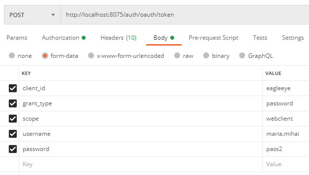
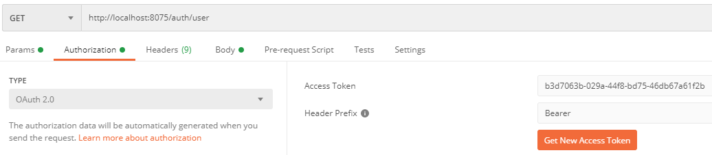

# Spring Microservices in Action - Security Service
Spring Boot Microservice project.

## Description
The project represents my implementation based on the "Spring Microservices in Action" book.

A Spring-based OAuth2 service.

An overview of all the projects involved can be found [here](https://github.com/mariamihai/sma-overview).

## Docker images
Automatic building was implemented for the microservices associated with this project.
For simplicity, I am using the build numbers provided by Travis CI as the version number for each different image constructed.

## Implementation details
### Properties
- application server port
```
server.port=8075
```
- setting the path for the app
```
server.servlet.context-path=/auth
```

### Profiles
There is no active profile defined for the current project.

## API calls
### Credential validation
 * __URI:__ _auth/oauth/token_
 
 * __Method:__ _POST_

 * __URL params:__ <br/>
    * required: - <br/>
    * optional: - <br/>
    
 * __Query params:__ <br/>
    * required: - <br/>
    * optional: - <br/>
        
 * __Successful call:__
    * set basic authentication using the application key and secret
    
    
    * add the application, secret key, grant type, user ID and password
    
    
    * __Response:__
        * Code: 200 OK <br/>
        * Content:
        ```
        {
            "access_token": "b3d7063b-029a-44f8-bd75-46db67a61f2b",
            "token_type": "bearer",
            "refresh_token": "a5f130eb-d37a-4084-990b-c9dbb7e1fcbd",
            "expires_in": 43199,
            "scope": "webclient"
        }
        ```
        
 * __Failed call:__
 
    * __Response:__
        * Code: 401 Unauthorized <br/>
        * Content: TODO - will be added
        ```
        {
            "error": "unauthorized",
            "error_description": "Full authentication is required to access this resource"
        }
        ```

### User endpoint to validate the token and retrieve the user information
 * __URI:__ _auth/user_
 
 * __Method:__ _POST_

 * __URL params:__ <br/>
    * required: - <br/>
    * optional: - <br/>
    
 * __Query params:__ <br/>
    * required: - <br/>
    * optional: - <br/>
      
 * __Successful call:__
    * set access token
    
    
    * __Response:__
        * Code: 200 OK <br/>
        * Content:
        ```
        {
            "user": {
                "password": null,
                "username": "maria.mihai",
                "authorities": [
                    {
                        "authority": "ROLE_ADMIN"
                    }
                ],
                "accountNonExpired": true,
                "accountNonLocked": true,
                "credentialsNonExpired": true,
                "enabled": true
            },
            "authorities": [
                "ROLE_ADMIN"
            ]
        }
        ```
        
 * __Failed call:__
 
    * __Response:__
        * Code: 401 Unauthorized <br/>
        * Content:
        ```
        {
            "error": "invalid_token",
            "error_description": "Invalid access token: b3d7063b-029a-44f8-bd75-46db67a6"
        }
        ```
